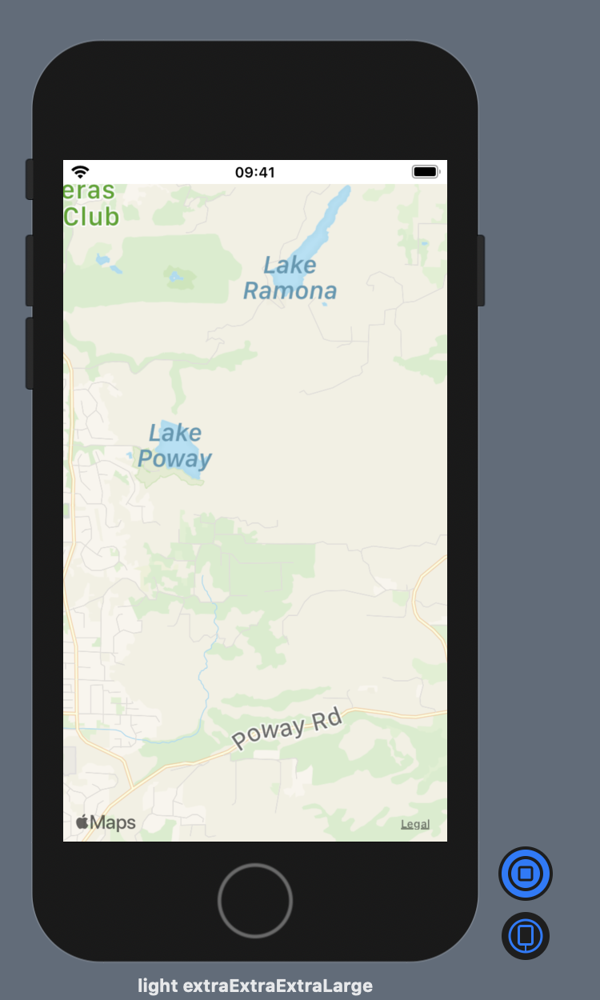

This project demonstrates

* MapKit in SwiftUI using `UIViewRepresentable`
* Pass in parameters to the MapView so that we can test different map types using [`MKMapType`](https://developer.apple.com/documentation/mapkit/mkmaptype)
* Multiple SwiftUI Preview Devices in the SwiftUI canvas
* A demo app in [Mac Catalyst](https://developer.apple.com/documentation/uikit/mac_catalyst).

---

---

---

---

---

Convert Screen captures in ImageMagick

~~~ console
convert *.png -crop 750x1250+2200+300 SwiftUI%d.png
convert -delay 200 SwiftUI*.png README-SwiftUI-canvas.gif
~~~
