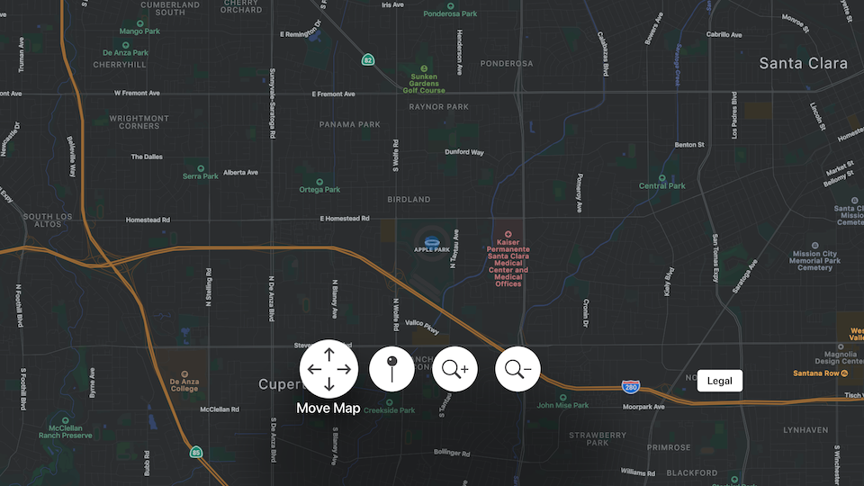

# MapKit-SwiftUI-for-tvOS

MapKit built with SwiftUI for tvOS

References
* `UIViewRepresentable`, A view that represents a UIKit view. — [https://developer.apple.com/documentation/swiftui/uiviewrepresentable](https://developer.apple.com/documentation/swiftui/uiviewrepresentable)
* Advanced MKMapView with SwiftUI — [https://www.hackingwithswift.com/books/ios-swiftui/advanced-mkmapview-with-swiftui](https://www.hackingwithswift.com/books/ios-swiftui/advanced-mkmapview-with-swiftui)

## MKMapViewDelegate

[View in Source](x-source-tag://MKMapViewDelegate)

The MapKit life cycle for tvOS   

~~~ console
mapView(_:regionWillChangeAnimated:)
mapViewDidChangeVisibleRegion(_:)
mapView(_:regionDidChangeAnimated:)
mapView(_:regionWillChangeAnimated:)
mapViewDidChangeVisibleRegion(_:)
mapView(_:regionDidChangeAnimated:)
mapViewWillStartRenderingMap
mapViewWillStartLoadingMap
mapViewDidFinishLoadingMap
mapViewDidFinishRenderingMap
~~~

---

