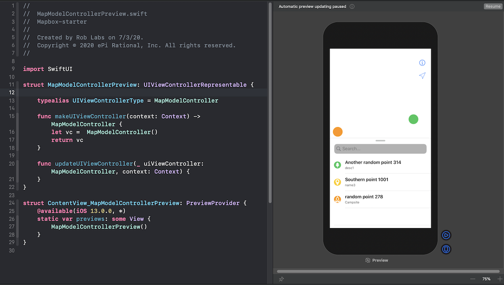
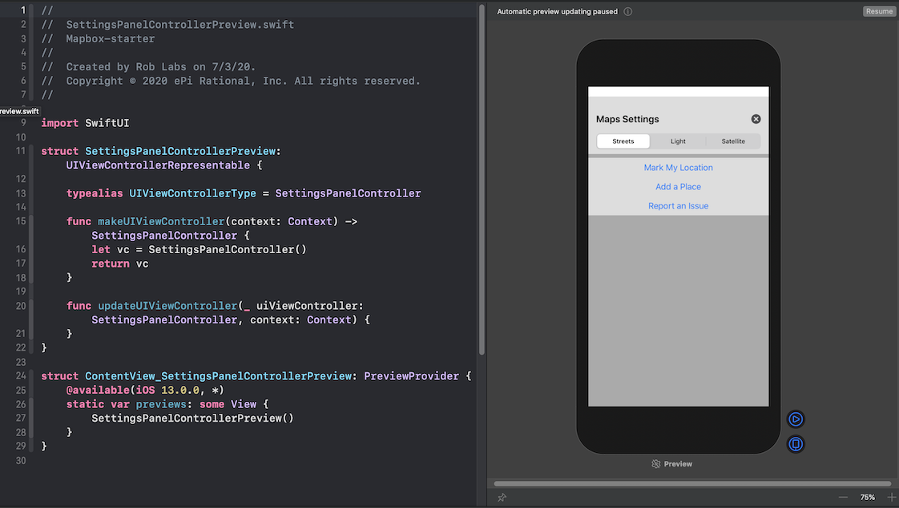
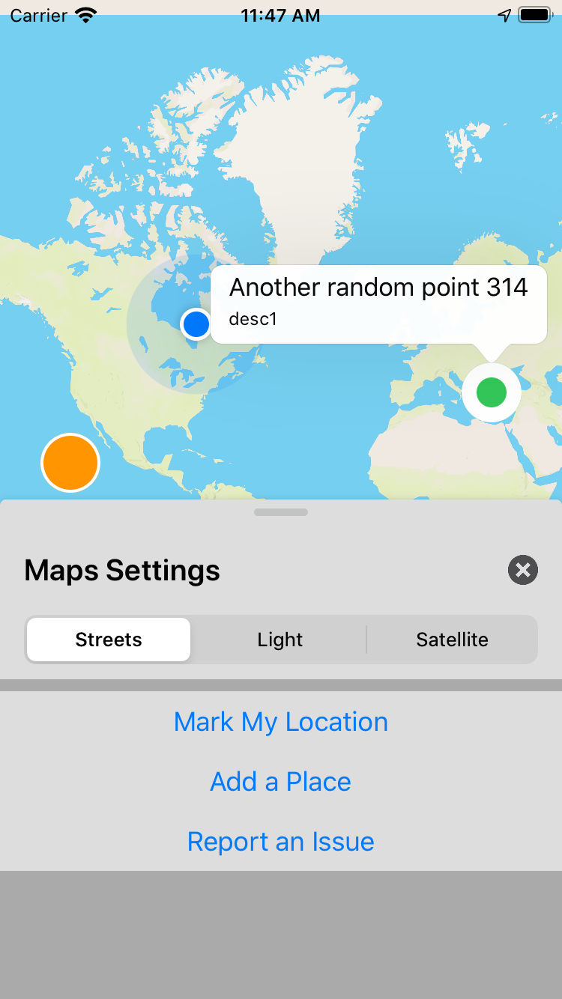

#  Mapbox Starter


## Preview UIKit view controllers with SwiftUI

UIKit is one way to build a user interfaces for iOS.  SwiftUI was introduced in iOS 13 and it also has many powerful features such as previewing directly in Xcode.

This project was written using UIKit.  Since this project supports back to iOS 11, then it makes sense to leave the UIKit as is.  Another benefit of this project is show how to build User Interfaces without storyboards.

But [SwiftUI](https://developer.apple.com/documentation/swiftui) has a lot of powerful features including:

* *Generate dynamic, interactive previews of your custom views.*  See [Views and Controls](https://developer.apple.com/documentation/swiftui/views-and-controls)
* *Control the size, position, and appearance attributes of the view.* See [Previews](https://developer.apple.com/documentation/swiftui/previews)

You can add a SwiftUI to your UIKit project to soft preview the UIKit components.  With SwiftUI, the Preview debugger in Xcode is used to show the UIKit `view`.  This makes UIKit development easier to do without having to build an entire app.

---

### *Example:*  Automated Mapbox Map UI testing

Automated User Interface testing is now setup.  [View the UI Test `testStyles` in Xcode](x-source-tag://testStyles)

```swift
  app.launch()

  // Info button, upper right corner
  app.buttons["More Info"].tap()

  // Change Styles
  app.buttons["Light"].tap()
  app.buttons["Satellite"].tap()
  app.buttons["Streets"].tap()
```

---

### *Example:*  Mapbox Map

On the left is the SwiftUI code that displays the Map view controller.  On the right is the Preview window.

* [View `MapModelControllerPreview` in Xcode](x-source-tag://MapModelControllerPreview_SwiftUI)



---

### *Example:*  Settings control

On the left is the SwiftUI code that displays the Settings view controller.  On the right is the Preview window.

* [View `SettingsPanelControllerPreview` in Xcode](x-source-tag://SettingsPanelControllerPreview_SwiftUI)
* [View `SettingDetailControllerPreview` in Xcode](x-source-tag://SettingDetailControllerPreview)




---

### *Example:*  Mapbox Starter

This is what running in the simulator looks like.


