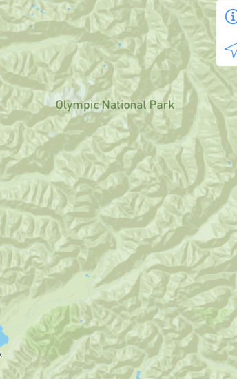
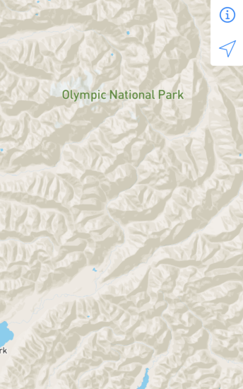

#  Mapbox Starter

## Tile Picker

This repo includes sample code on how to implement a tile picker.  View the [Tile Picker code in Xcode](x-source-tag://tagTilePicker)

##### Goal

Given a set of arbitrary shaped grids defined in a GeoJSON
* Initially paint all grids Gray
* Allow user to tap on a grid to toggle the choice.  Red is selected, Gray is deselected
* Built using
  * [https://docs.mapbox.com/ios/api/maps/5.9.0/predicates-and-expressions.html](https://docs.mapbox.com/ios/api/maps/5.9.0/predicates-and-expressions.html)
  * [https://github.com/mapbox/mapbox-gl-native-ios/blob/master/platform/ios/docs/guides/For%20Style%20Authors.md#expression-operators](https://github.com/mapbox/mapbox-gl-native-ios/blob/master/platform/ios/docs/guides/For%20Style%20Authors.md#expression-operators)

---


---

## Preview UIKit view controllers with SwiftUI

UIKit is one way to build a user interfaces for iOS.  SwiftUI was introduced in iOS 13 and it also has many powerful features such as previewing directly in Xcode.

This project was written using UIKit.  Since this project supports back to iOS 11, then it makes sense to leave the UIKit as is.  Another benefit of this project is show how to build User Interfaces without storyboards.

But [SwiftUI](https://developer.apple.com/documentation/swiftui) has a lot of powerful features including:

* *Generate dynamic, interactive previews of your custom views.*  See [Views and Controls](https://developer.apple.com/documentation/swiftui/views-and-controls)
* *Control the size, position, and appearance attributes of the view.* See [Previews](https://developer.apple.com/documentation/swiftui/previews)

You can add a SwiftUI to your UIKit project to soft preview the UIKit components.  With SwiftUI, the Preview debugger in Xcode is used to show the UIKit `view`.  This makes UIKit development easier to do without having to build an entire app.

---

### *Example:*  Automated Mapbox Map UI testing

Automated User Interface testing is now setup.  

* [View the UI Test `testStyles` in Xcode](x-source-tag://tagTestStyles)
* [View the UI Test `testStyles` on GitHub](https://github.com/roblabs/ios-map-ui/search?q=tagTestStyles&unscoped_q=tagTestStyles)

```swift
  app.launch()

  // Info button, upper right corner
  app.buttons["More Info"].tap()

  // Change Styles
  app.buttons["Light"].tap()
  app.buttons["Satellite"].tap()
  app.buttons["Streets"].tap()
```

---

### *Example:*  Toggle Mapbox Style Layers

`toggleLayer` — Turn Mapbox Style layers on and off.  

* [View `toggleLayer` in Xcode](x-source-tag://tagtoggleLayer)
* [View `toggleLayer` on GitHub](https://github.com/roblabs/ios-map-ui/search?q=togglelayer&unscoped_q=togglelayer)

```swift
  # Example #
  toggleLayer("land")
  toggleLayer("national-park")
```

```lldb
  # Debugger #
  # print out the layers array to inspect the layer identifiers
  po mapView.style?.layers
```

* Layer `national-park`
* iOS Demo of toggling layer between `visible` & `none`

*national-park-visible*



*national-park-none*



---

### *Example:*  Mapbox Map

On the left is the SwiftUI code that displays the Map view controller.  On the right is the Preview window.

* [View `MapModelControllerPreview` in Xcode](x-source-tag://MapModelControllerPreview_SwiftUI)
* [View `MapModelControllerPreview` on GitHub](https://github.com/roblabs/ios-map-ui/search?q=MapModelControllerPreview_SwiftUI&unscoped_q=MapModelControllerPreview_SwiftUI)


---

### *Example:*  Settings control

On the left is the SwiftUI code that displays the Settings view controller.  On the right is the Preview window.

* [View `SettingsPanelControllerPreview_SwiftUI` in Xcode](x-source-tag://SettingsPanelControllerPreview_SwiftUI)
* [View `SettingDetailControllerPreview` in Xcode](x-source-tag://SettingDetailControllerPreview)


---

### *Example:*  Mapbox Starter

This is what running in the simulator looks like.


