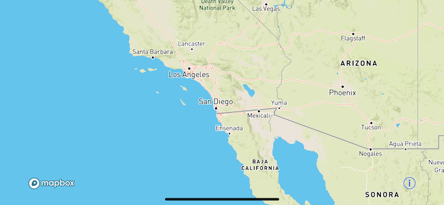
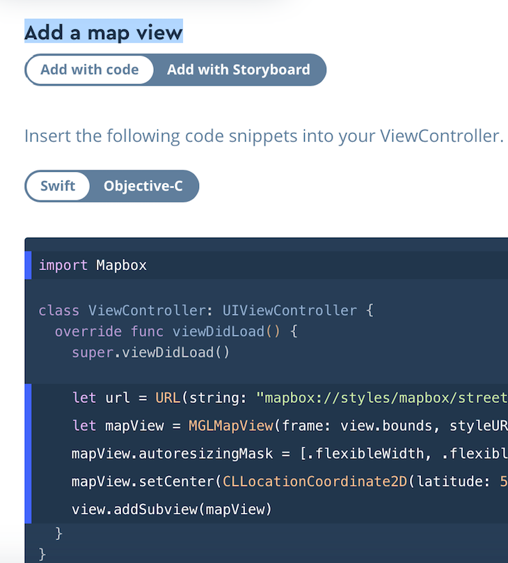
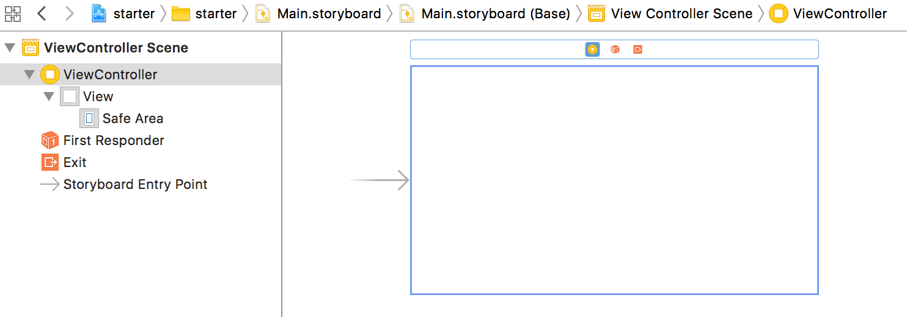
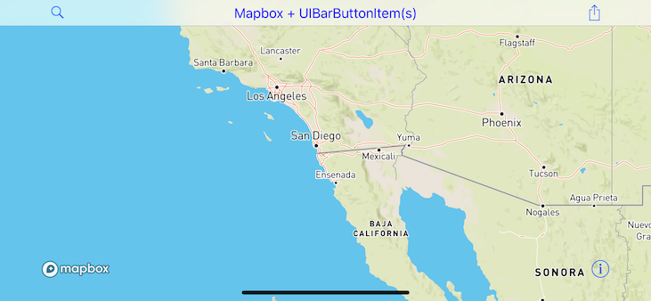
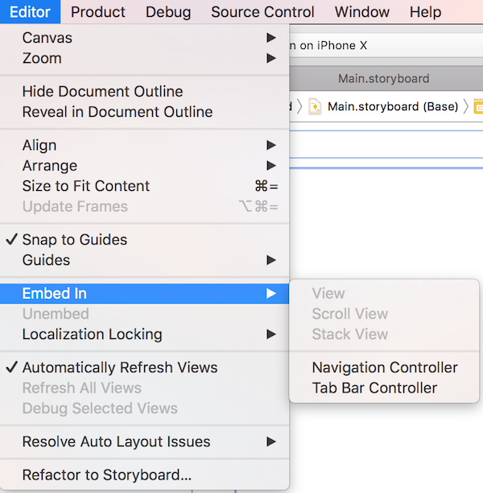
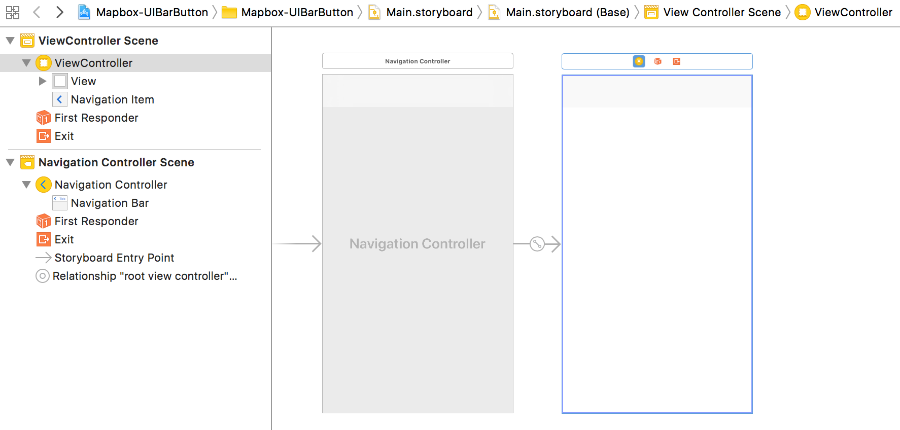
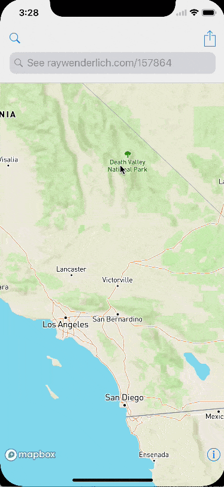
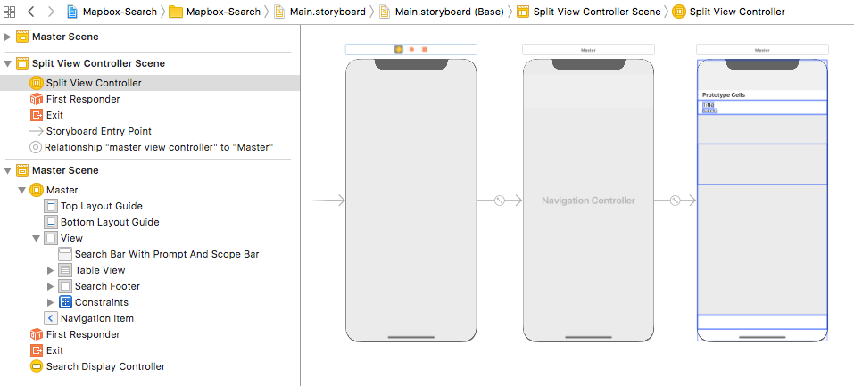

# Using Swift to create Maps while minimizing reliance on storyboards

Explore the project at [github.com/roblabs/ios-map-ui](https://github.com/roblabs/ios-map-ui/)

# Mapbox Starter

A starter project for Mapbox maps in iOS

## Features
* A starter Mapbox project built off the steps documented at [https://www.mapbox.com/install](https://www.mapbox.com/install)
* Built using Carthage.  Install by running `carthage update`
* Made with Xcode Version 9.1 (9B55), and Swift 4

### How to Use
* Add a `MGLMapboxAccessToken` key to the `Info.plist`.
  * See [https://www.mapbox.com/install/ios/carthage-permission](https://www.mapbox.com/install/ios/carthage-permission)
  * See [https://www.mapbox.com/help/how-access-tokens-work/](https://www.mapbox.com/help/how-access-tokens-work/)


#### Screen Shots

Initial zoom and center



##### Storyboard

* Built using the option *Add with code*, so no storyboard was used in this demo.  Adding it for reference.



---

Empty Storyboard; all views added via code




---

# Mapbox-UIBarButton

A Mapbox map with `UIBarButtonItem` added using Swift, with minimal use of the storyboard.

## Features
* Built upon Mapbox Starter
* Made with Xcode Version 9.1 (9B55), and Swift 4
* Added [`UIBarButtonItem`](https://developer.apple.com/documentation/uikit/uibarbuttonsystemitem) and code handlers to take action when they are clicked.
``` Swift
override func viewDidLoad() {
    super.viewDidLoad()

    // MARK:- UIBarButtonItem
    self.navigationItem.leftBarButtonItem = UIBarButtonItem(
        barButtonSystemItem: .search,
        target: self,
        action: #selector(handleLeftBarButton))

    self.navigationItem.rightBarButtonItem = UIBarButtonItem(
      barButtonSystemItem: .action,
      target: self,
      action: #selector(handleRightBarButton))
}
```

#### Screen Shots

Initial zoom and center



##### Storyboard

* Added a [UINavigationBar](https://developer.apple.com/documentation/uikit/uinavigationbar), which is done by Embedding the view controller in Navigation Controller
  * Click your view controller
  * `Editor` > `Embed In` > `Navigation Controller`



---



---


# Mapbox-Search

A Mapbox map with `UISearchBar` added using Swift, with minimal use of the storyboard.


## Features
* Built upon Mapbox UIBarButtonItem
* Made with Xcode Version 9.1 (9B55), and Swift 4
* Mapbox map disappears when searching and a `UITableView` pops up with filtered search results
* The Search portion is based on the tutorial called *UISearchController Tutorial: Getting Started* from [RayWenderlich.com](https://www.raywenderlich.com/157864/uisearchcontroller-tutorial-getting-started).  Please see the license file in each file for information.
* Integrating `UISearchController` is a mixture of Storyboards and Swift code.
* Based on event handlers for when the search is started or ended, the Mapbox `mapView` is hidden or displayed.


#### Screen Shots




##### Storyboard

---



---
